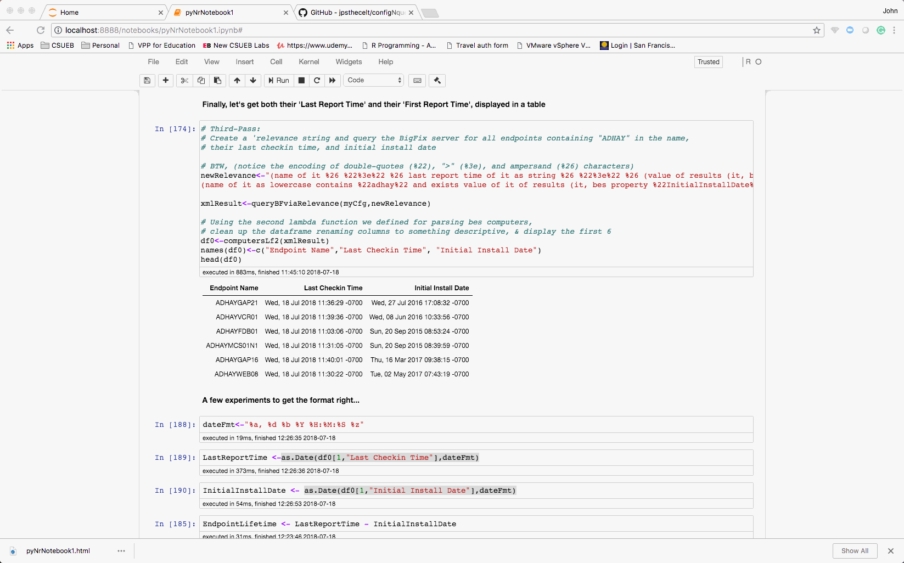
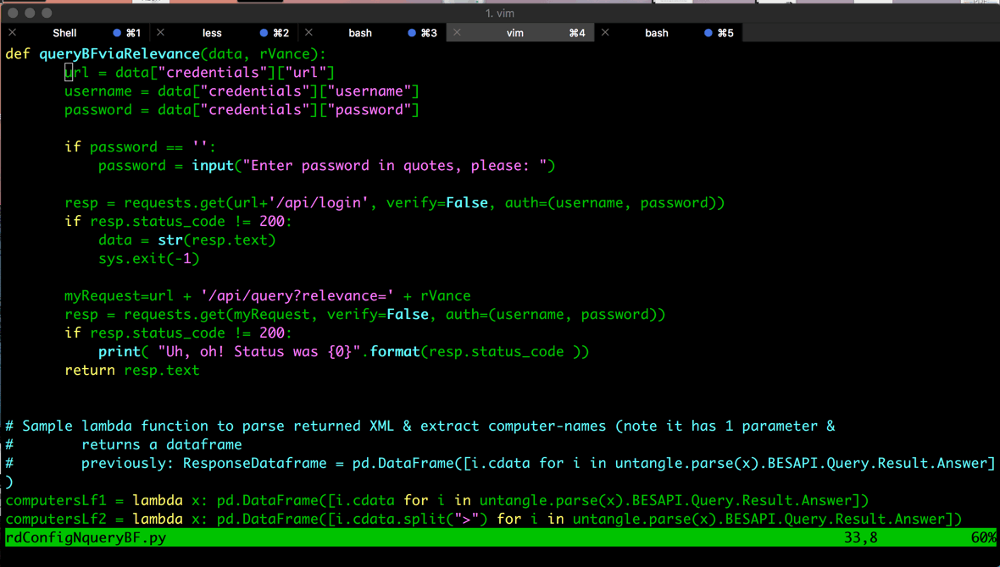

SYNOPSIS:
========
(jpsinger-06.01.18)

This notebook (an R session which calls Python 'helper-routines' from **rdConfigNqueryBF.py**) demonstrates interaction between R and Python programs and dataframes, showing the best features of both languages.

The program opens and reads credentials & URL from a configuration-file (credentials.json), creates a BigFix 'query-channel', and extracts endpoint information from the BigFix management server, to be manipulated and graphed using R libraries.

[Sample ggplot graph from BF query ('hover' cursor here)](LifetimeVsNumEndpoints-ADHAY.png)

PROJECT PREREQUISITES:
=====================
1) On your development machine, you must provide the following properly-working setup:
- An up-to-date Jupyter (iPython) or anaconda installation, suitable for executing the commandline 
'jupyter notebook .'
- A working installation of R
- An working jupyter R kernel, installed within Commandline R, as per: 
https://www.datacamp.com/community/blog/jupyter-notebook-r
- Using the BigFix connection to query the BigFix server requires the use of a 4GL language called Relevance. This is used as a parameter to the query function, **queryBFviaRelevance()**
[See https://www.ibm.com/support/knowledgecenter/en/SS6MCG_9.2.0/com.ibm.tivoli.tem.doc_9.2/Platform/Relevance/c_relevance_overview.html].

The Python-Reticulate-R-BF-query Notebook:

DETAILS:
=======
So, the configuration-file used in both the commandline and Jupyter-Notebook scenarios is stored in a file 
called 'credentials.json' (for privacy reasons, I leave this in the parent-directory). The python routine
readConfig() then reads the specified BigFix server URL, username, and password from the credentials.json file and 
returns it as a configuration-dictionary. These elements can then be used as the first parameter in the 
queryBFviaRelevance(p1, p2) call.

The sample notebook file shows a typical scenario of running R within a Jupyter Notebook which loads the python 
source code and calls the routines to first extract logon-information from the configuration file, and then 
make several queries to BigFix, 'munging' the returned information into a format which we can manipulate via R.

It uses the routines readConfig(<filename>) and queryBFviaRelevance(credential-dict, relevance-string).

    
The XML returned by queryBFviaRelevance() is parsed using a lambda-function containing calls to the python 
library 'untangle', all within a list-comprehension of the '<Answer>' nodes within the XML.  

Finally, the lambda-function returns a python DataFrame, which can be read from R courtesy of the R 
Reticulate library.

As far as 'crafting' potential Relevance queries, Sample phrases might be something like 'names of bes computers' or 
'names whose (it as lowercase contains "player") of bes computers' [Notice that embedded quotes and other characters
like '& within the Relevance must be 'escaped' by using the ascii-hex string equivalents (i.e. like %22)].

The ultimate intent is to use this as a configuration/query step in generating pretty graphs from within R & Zeppelin
notebooks, eventually using it all within 'R'-style 'shiny' apps.

best,
jpsinger, wizard-at-large
INCEPT-DATE: 6.1.18
